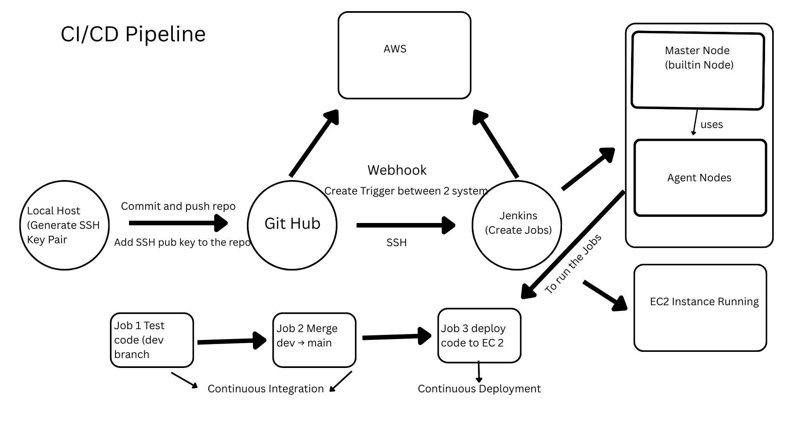

# CI/CD Pipeline Documentation

This repository contains detailed documentation for each stage of the CI/CD pipeline:

## Table of Contents
- [Overview](#overview)
- [CI/CD Pipeline Diagram](#cicd-pipeline-diagram)
- [Why This Pipeline Was Set Up](#why-this-cicd-pipeline-was-set-up)
- [Benefits of This Approach](#benefits-of-this-approach)
- [Business Value](#business-value-and-future-value)
- [Job 3 – Continuous Deployment](#job-3--continuous-deployment-cd)
- [Conclusion](#conclusion)

- [Job 1 – Continuous Integration (CI)](Job1_rashmina_ci-test.md)
- [Job 2 – Merge dev → main (CI)](Job2-ci-merge.md)
- [Job 3 – Continuous Deployment (CD)](Job3-cd-deploy.md)
- [SSH Authentication with GitHub](SSHReadme.MD)

### CI/CD Pipeline – Jenkins, GitHub & AWS EC2
#### Overview
This document explains how I designed, built, and tested a complete CI/CD pipeline using GitHub, Jenkins, and AWS EC2.
The pipeline automates the full journey from a code change to a live deployment, removing manual steps and reducing risk.

### This README provides a high-level overview of the CI/CD pipeline. 
Detailed configuration steps, commands, and screenshots are documented in the individual Job Markdown files linked above.

### CI/CD Pipeline Diagram

#### What this diagram shows
* Code is written and committed locally
* Changes are pushed to GitHub
* A webhook automatically triggers Jenkins
* Jenkins runs three jobs:
     * Job 1: Test code (CI)
     * Job 2: Merge dev → main (CI)
     * Job 3: Deploy to EC2 (CD)
* The application is deployed to a live EC2 instance

This separation ensures each stage has a clear responsibility,
reducing risk while improving reliability.

### Why This CI/CD Pipeline Was Set Up
This setup was created to prepare the application for a real-world CI/CD workflow.
#### Instead of:
* Manually copying files
* Running tests by hand
* Deploying directly to a server
The goal was to:
* Automate testing
* Control merging
* Automate deployment

GitHub acts as the source, while Jenkins securely accesses the repository using SSH authentication, without passwords or personal credentials.

#### Benefits of This Approach
1. Automation and Consistency: 
By committing only the application source code and excluding node_modules, Jenkins installs dependencies fresh on every run.

#### This ensures:
* The same process runs every time
* Fewer human errors

Strong Security: 
SSH keys are used instead of usernames and passwords.

* No credentials are stored in scripts.
* Access can be revoked instantly if needed.
* Jenkins can authenticate securely and independently.

Clean and Professional Repository
The repository contains:
* Source code only
* Configuration files
* Tests

Large or sensitive files are excluded, keeping the repository:
* Lightweight
* Secure
* Easy to maintain

2. Early Detection of Problems: 
Automated tests run before any merge or deployment.

This allows issues to be caught early, before broken code reaches production.

#### Problems and Challenges Faced
##### SSH Configuration Complexity
Setting up SSH authentication required careful handling of:
* Key generation
* Jenkins credentials
* SSH agent configuration
* GitHub key registration

Although challenging at first, this setup significantly improves security and automation once completed.

#### Business Value and Future Value
### Saves Time and Money
Automation reduces:
* Manual testing time
* Manual deployment errors
* Developer effort

This allows teams to focus on building features instead of fixing avoidable issues.

### Improves Reliability
Automated testing and controlled deployment reduce the risk of:
* Broken releases
* Downtime
* Customer-facing issues
Reliable systems protect business reputation.

### Scales With Team Growth
Manual processes do not scale well.

#### This setup allows:
* Multiple developers to work safely
* Jenkins to handle builds and deployments
* Consistent quality regardless of team size

#### Industry-Ready Skills
This pipeline demonstrates practical skills in:
* Git and GitHub
* Secure authentication
* CI/CD concepts
* Jenkins automation
* Cloud deployment practices

#### Job 3 – Continuous Deployment (CD)
### Overview
* Job 3 is the Continuous Deployment stage of the pipeline.
* Its purpose is to deliver a version of the application that is already known to work into the live environment safely and reliably.
* Job 3 is responsible only for delivery.
By the time this stage runs, the code has already been tested and approved.
This ensures that only safe, verified updates ever reach the live environment.

#### What Job 3 Does

### Job 3:

* Takes a tested and approved version of the application
* Deploys it to an AWS EC2 instance
* Restarts the application safely
* Runs automatically with no manual steps

This job runs only after Job 2 completes successfully, ensuring unfinished work never reaches users.

### How Job 3 Fits Into the Pipeline
* Job 1 tests new changes
* Job 2 merges approved changes
* Job 3 deploys those changes to users
  
This separation ensures delivery is safe and controlled.

#### Security and Safety Considerations
* Secure SSH access is used for deployment
* No manual changes are made on the production server
* Only Jenkins is allowed to deploy code
  
This keeps the live environment stable and protected.

#### Evidence of Successful Deployment
Detailed console output, deployment screenshots, and confirmation of live application changes
are documented in the Job 3 Continuous Deployment file:

➡️ [View Job 3 – Continuous Deployment Evidence](Job3-cd-deploy.md)

#### Why Job 3 Matters to the Business
Job 3 ensures that:
  * Updates can be released safely
  * Downtime is minimised
  * Releases are predictable
  * Delivery does not depend on one person

The result is a calm, repeatable deployment process that supports growth.

#### Personal Reflection
This task demonstrates my ability to:
* Take ownership of the delivery stage
* Design systems with both technical and business impact in mind
* Build automation that is reliable and secure.

### Conclusion
* This CI/CD pipeline automates the entire process from code change to live deployment.
* By separating testing, merging, and deployment into clear stages, the system delivers speed, reliability, and confidence for both developers and the business.

