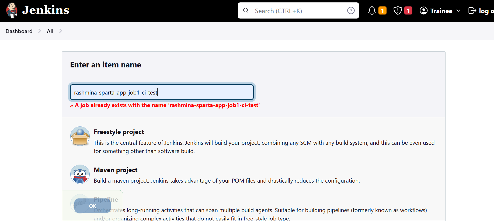
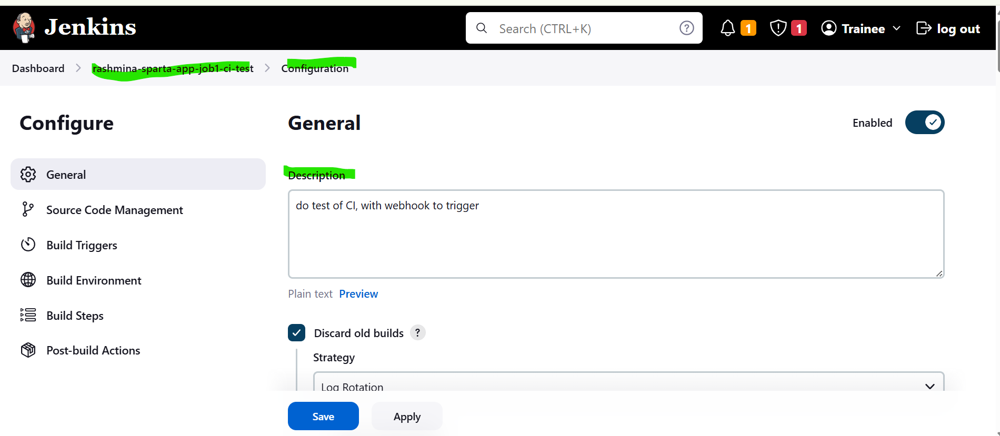
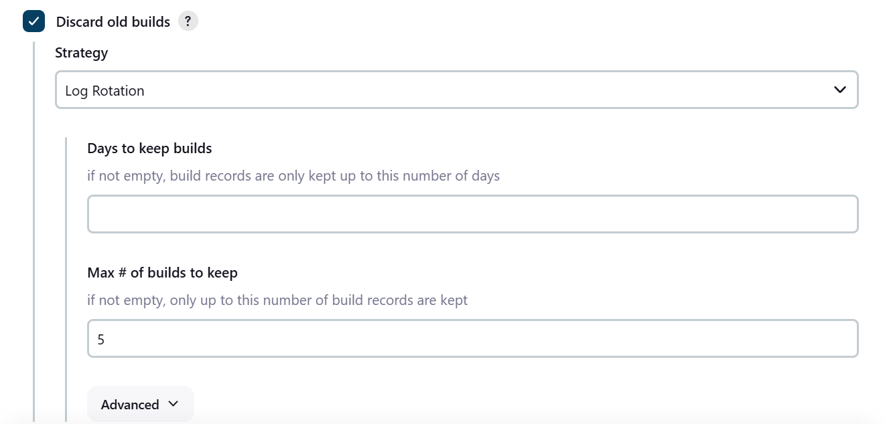
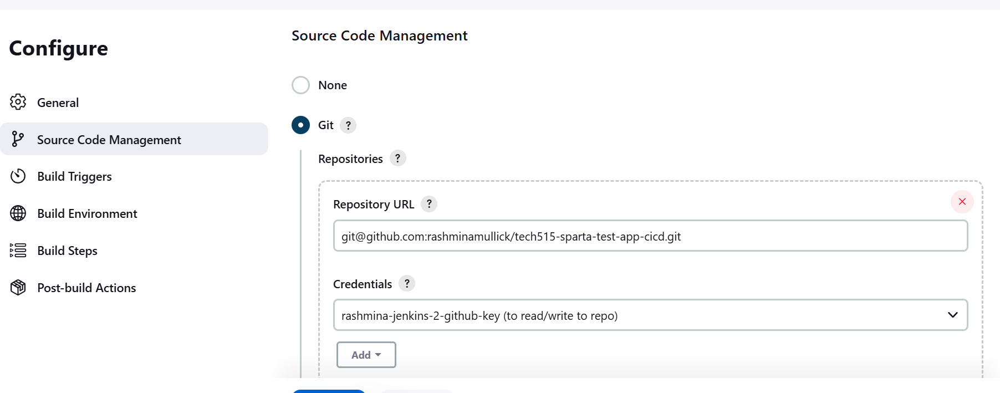
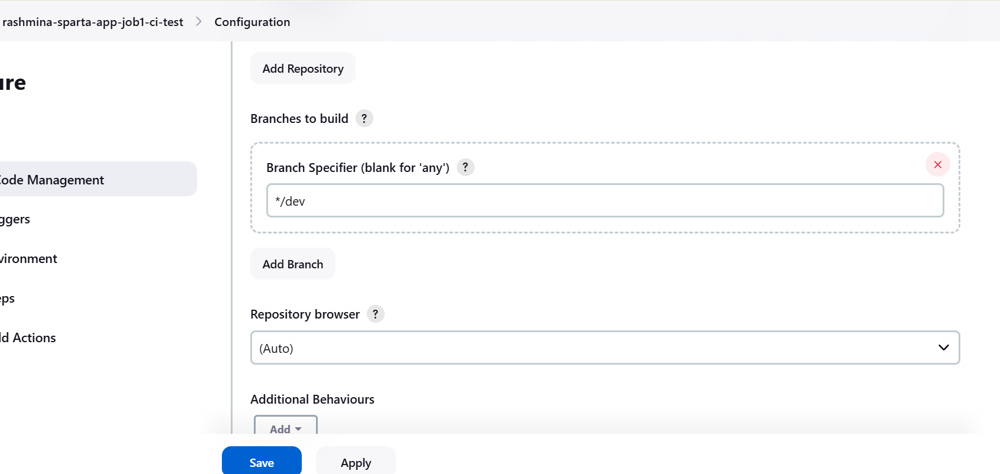
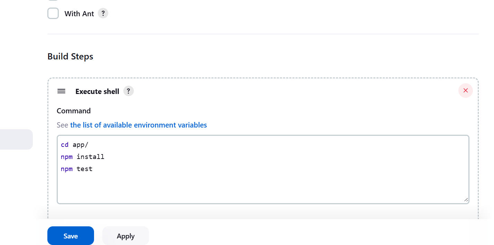

# What is Jenkins?
* Jenkins is an open-source automation tool that helps test and build applications automatically.
Instead of running tests manually, Jenkins does this work for us every time code changes, which makes the process faster, more reliable, and less error-prone.

## In this project, Jenkins is used to:
* Pull code from GitHub
* Run tests automatically
* Stop the pipeline if something is broken

### Why Job 1 Exists in the Pipeline

## Job 1 is the quality gate of the CI/CD pipeline.

### Its purpose is simple:

Only allow tested, working code to move forward.
* Broken code never reaches production
* Problems are found early
* Developers get fast feedback

## Creating Job 1 in Jenkins (Step by Step)

## Step 1: Create a New Jenkins Job

### After logging into Jenkins:
* Click New Item
* Enter the job name:
* rashmina-sparta-app-job1-ci-test
* Select Freestyle project
* Click OK

### Why I choose Freestyle?
* It gives full control and is ideal for learning and demonstrating CI clearly.

## Step 2: Adding a Clear Job Description
### In the General section, I added a short description:

* “Do test of CI, with webhook to trigger”

 

###  Why this matters:
* Anyone viewing the job can immediately understand its purpose.

## Step 3: Manage Build History (Stability & Performance)
### I enabled Discard old builds and set:
* Maximum builds to keep: 5
* 
  

### Why this matters:
* This prevents Jenkins from using unnecessary disk space and keeps the system stable over time.

### Source Code Management (Connecting GitHub)
## Step 4: Configure GitHub Repository

### In Source Code Management:
* Selected Git
* Added the repository URL:
    git@github.com:rashminamullick/tech515-sparta-test-app-cicd.git
* Selected stored SSH credentials

  
  ### Why SSH is used:
* SSH is more secure than passwords and allows Jenkins to access GitHub safely.

## Step 5: Specify the Branch to Build
### In Branches to build, I set:
    */dev

  

### Why dev branch?
* All testing happens on the development branch before anything reaches main.

### Build Steps – Running Automated Tests
## Step 6: Add Build Commands
* Under Build Steps, I selected Execute shell and added:

cd app/
npm install
npm test

### What this does?:
* Moves into the app folder
* Installs required dependencies
* Runs automated tests
* Followed by clicking save to save your job

### Why this is important:
* If tests fail, the pipeline stops immediately and finally protecting production.

 ### Running the Job
## Step 7:Build the Job
* After the job has been created, on the left hand side click Build now to run the job.
* Jenkins runs the job automatically

 

## Step 8: Checking the Results
* Blue circle ✅ → Tests passed
* Red circle ❌ → Something failed
#### The job will then show under Build history, if the commands have ran successfully it will show a blue circle, however if it has failed I will see a red circle.
 
### I can click Console Output to:
* Confirm successful execution
* See error messages if the build fails
Finally I can right click on the job and press on console output to show the successful output or if it failed it will tell me the error on the output.
 
 ### Why this is valuable:
* It makes troubleshooting fast and transparent.

#### Outcome of Job 1
### When Job 1 succeeds:
* Code is confirmed working
* The pipeline moves forward to Job 2
* Confidence in deployment increases

### When Job 1 fails:
* Pipeline stops
* No broken code is merged
* Issues are fixed early

### Why This Job Adds Value
 #### For Me
* Less manual testing
* Faster feedback
* Confidence in my code

#### For an Organisation
* Fewer production issues
* Faster release cycles
* Reliable automation
* Better developer productivity

