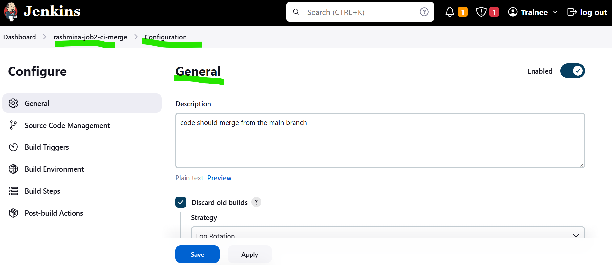
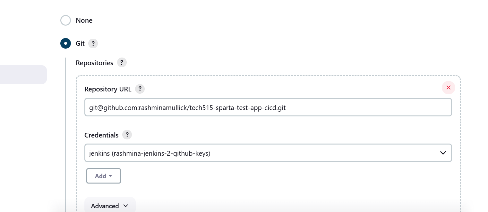
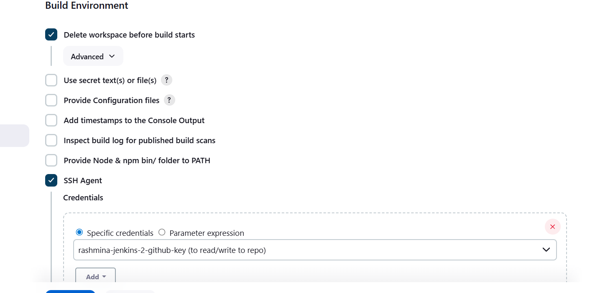
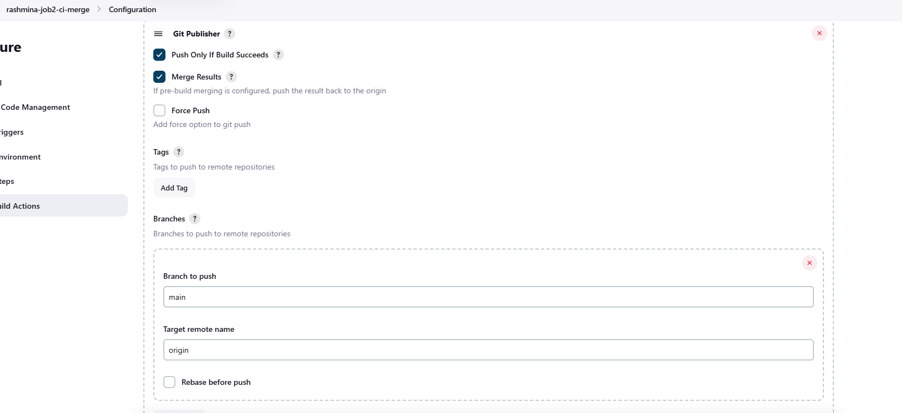
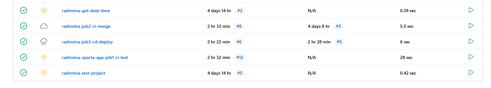
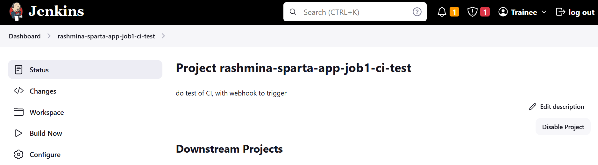

##  Merging code with Git branches (Dev and Main)
* Below, I have created a guide to show how to merge code from the Dev branch to our Main branch using Jenkins, only after all tests have passed successfully.
This job ensures that untested or broken code never reaches the main branch.
  
## Creating Job 2 – CI Merge Job
#### Step 1: Create the Job
* In Jenkins, click New Item
* Give the job a suitable name ( rashmina-job2-ci-merge)
* Select Freestyle project
* Click OK
#### This creates a new Jenkins job dedicated to merging code.
 

#### Step 2: General Configuration
#### In the General section, I added the job description:

“code should merge from the main branch”

#### I then:
* Enabled Discard old builds
* Used log rotation to limit stored builds (to avoid server overload)
#### This keeps Jenkins clean and prevents unnecessary storage usage.

### Source Code Management (GitHub Integration)
#### Step 3: Connect Jenkins to GitHub
### In Source Code Management:
* Selected Git
* Added my repository URL
* Selected my stored Jenkins SSH credentials
(for read/write access to the repository)

 

#### Using SSH allows Jenkins to securely interact with GitHub without passwords.

### Merge Dev to Main Configuration
#### Step 4: Enable Merge Before Build
### Still under Source Code Management:
* I clicked Add additional behaviour
* Selected Merge before build
### This configuration allows Jenkins to:
* Take changes from the dev branch
* Merge them into the main branch automatically

#### This ensures the merge only happens inside Jenkins, not manually.

### Build Environment Setup
#### Step 5: Enable SSH Agent
#### In the Build Environment section:
* I selected SSH Agent
* Chose my SSH key exactly as in Jenkins:

“rashmina-jenkins-2-github-key (to read/write to repo)”

  
 #### This gives Jenkins permission to push the merged code back to GitHub. 

 ### Post-Build Actions – Push Only If Successful
#### Step 6: Configure Git Publisher
###### In Post-build Actions:
* Selected Git Publisher
* Enabled:
     * Push Only If Build Succeeds
     * Merge Results
* Set:
    * Branch to push: main
    * Target remote name: origin

#### This is a critical safety step:
* If the build fails → nothing is pushed
* If the build succeeds → merged code is pushed to main

### Testing the Merge Process
#### Step 7: Triggering the Pipeline
After making changes locally:
* I pushed the changes to the dev branch
* This automatically triggered Job 1 (CI Test) via webhook
(After I have made some changes to my local repo and pushed to the dev branch, it should automatically trigger my first job to notify that I have made some changes).
 

 #### Step 8: Automatic Merge Execution
* If Job 1 passes all tests:
    * Job 2 starts automatically
    * Jenkins merges dev → main
    * Jenkins pushes the updated code to GitHub
 
 
#### When successful:
* A blue circle appears next to the job
* Console output confirms a successful merge 
 
#### Outcome of Job 2
* Only tested code reaches the main branch
* Merges are automated and controlled
* Human error is reduced
* The pipeline remains safe and reliable

#### Why This Job Is Important?
### This job ensures:
* Main branch stability
* Clean Git history
* Safe collaboration
* Production-ready code only

