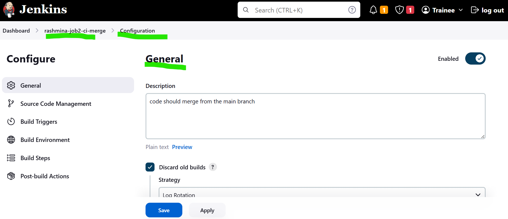
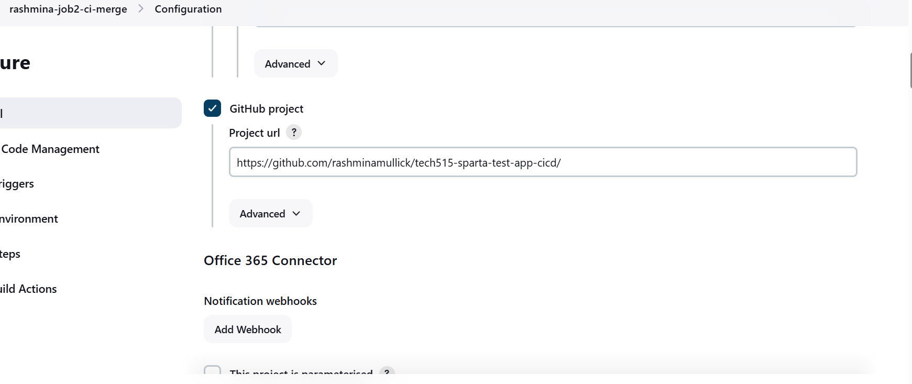
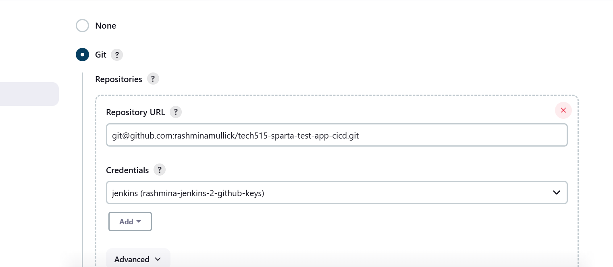
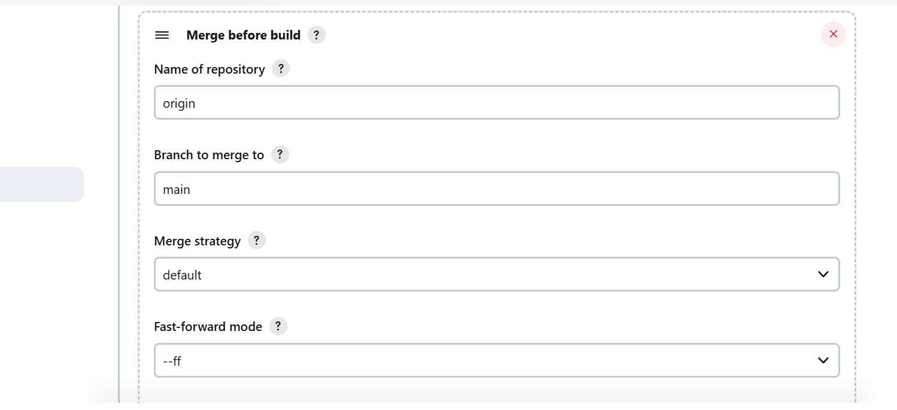
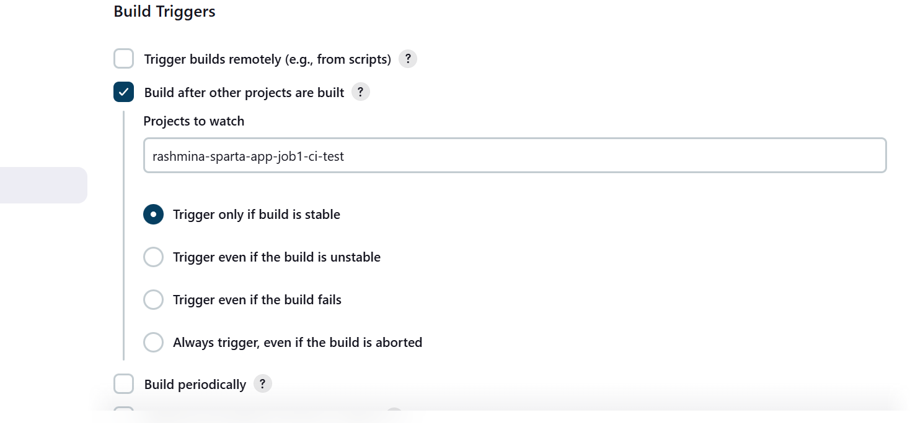
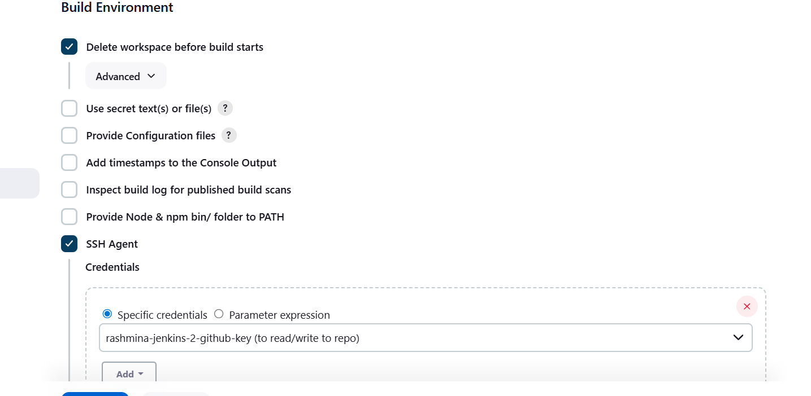
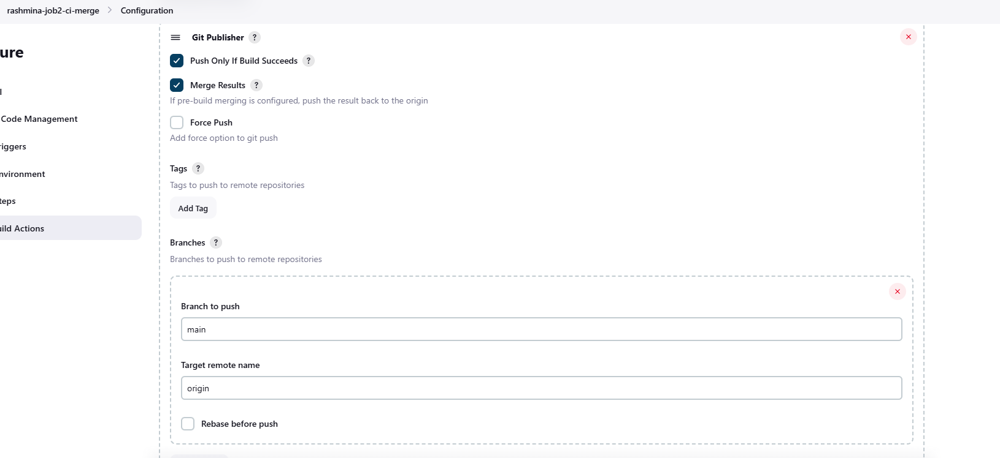
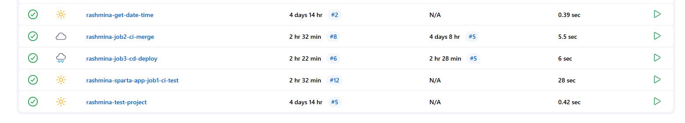
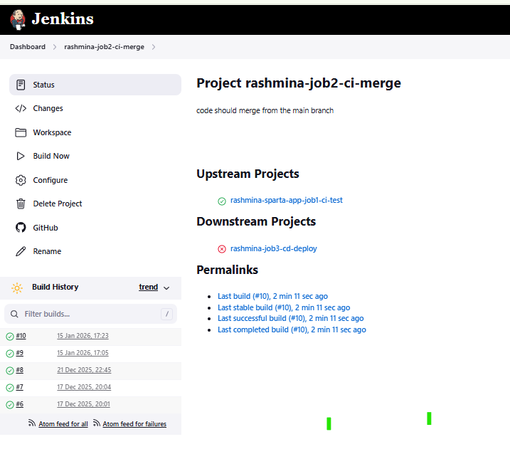

## Job 2 – Continuous Integration (Merge dev → main)
* “Merges tested code from the dev branch into the main branch.”

* Below, I have created a guide to show how to merge code from the Dev branch to our Main branch using Jenkins, only after all tests have passed successfully.

* This configuration allows Jenkins to prepare a merge from the dev branch into the main branch.
* Handling the merge within Jenkins rather than manually reduces human error and ensures consistent, repeatable merges.

* This job ensures that only code which has already passed testing is merged into the main branch.

## Creating Job 2 – CI Merge Job
#### Step 1: Create the Job
* In Jenkins, click New Item
* Give the job a suitable name ( rashmina-job2-ci-merge)
* Select Freestyle project
* Click OK
  
#### This creates a new Jenkins job dedicated to merging code.
 
#### Step 2: General Configuration
#### In the General section, I added the job description:

“Merges tested code from the dev branch into the main branch.”

#### I then:
* Enabled Discard old builds
* Used log rotation to limit stored builds (to avoid server overload)
#### This keeps Jenkins clean and prevents unnecessary storage usage.

### Source Code Management (GitHub Integration)
#### Step 3: Connect Jenkins to GitHub

### In Source Code Management:
* Selected Git
* Added my repository URL
* Selected my stored Jenkins SSH credentials
(for read/write access to the repository)

 

### Branch Configuration
* Jenkins checks out the dev branch
* Approved changes are merged into the main branch

#### Using SSH allows Jenkins to securely interact with GitHub without passwords.

### Merge Dev to Main Configuration
#### Step 4: Enable Merge Before Build
### Still under Source Code Management:
* I clicked Add additional behaviour
* Selected Merge before build
* Configured the repository and target branch
    

### Build Triggers – Controlled Pipeline Flow
#### Step 5: Trigger Job 2 Only After Job 1 Succeeds

* Enabled Build after other projects are built
* Set the project to watch:
  rashmina-sparta-app-job1-ci-test
* Selected Trigger only if build is stable

### Build Environment Setup
#### Step 6: Enable SSH Agent
#### In the Build Environment section:
* I selected SSH Agent
* Chose my SSH key exactly as in Jenkins:

“rashmina-jenkins-2-github-key (to read/write to repo)”

  
 #### This gives Jenkins permission to push the merged code back to GitHub. 

 ### Post-Build Actions – Push Only If Successful
#### Step 7: Configure Git Publisher
###### In Post-build Actions:
* Selected Git Publisher
* Enabled:
     * Push Only If Build Succeeds
     * Merge Results
* Set:
    * Branch to push: main
    * Target remote name: origin

#### This is a critical safety step:
* If the build fails → nothing is pushed
* If the build succeeds → merged code is pushed to main

### Testing the Merge Process
#### Step 8: Triggering the Pipeline
After making changes locally:
* I pushed the changes to the dev branch
* Pushing changes to the dev branch automatically triggers Job 1 (CI Test) via webhook.

 

 #### Step 9: Automatic Merge Execution
* If Job 1 passes all tests:
    * Job 2 starts automatically
    * Jenkins merges dev → main
    * Jenkins pushes the updated code to GitHub
 
 
#### When successful:
* A blue circle appears next to the job
* Console output confirms a successful merge 
 
#### Outcome of Job 2
* Only tested code reaches the main branch
* Merges are automated and controlled
* Human error is reduced
* The pipeline remains safe and reliable

#### Why This Job Is Important?
### This job ensures:
* Main branch stability
* Clean Git history
* Safe collaboration
* Production-ready code only

