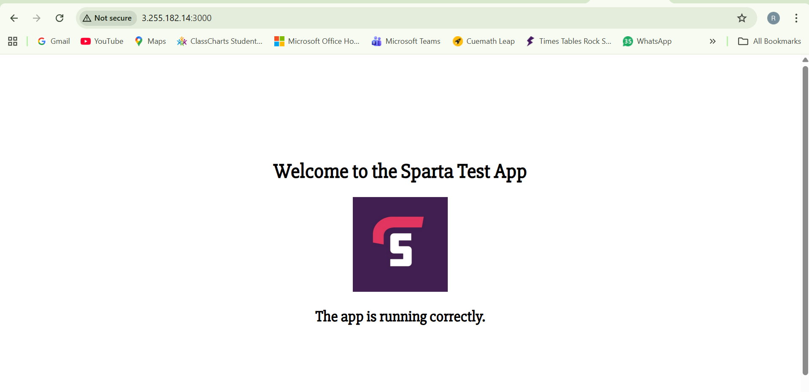

# Job 3 – Continuous Deployment (CD): Deploying the Application to AWS EC2

#### Purpose of Job 3
* Job 3 is responsible for deploying the application automatically to an AWS EC2 instance once the code has:
* Passed all tests (Job 1 – CI Test)
* Been successfully merged from dev to main (Job 2 – CI Merge)

#### This job completes the CI/CD pipeline by automatically reflecting approved code changes in the live application, without any manual deployment steps.

### Creating Job 3 – CD Deploy Job
#### Step 1: Create the Jenkins Job
### From the Jenkins dashboard:
* Click New Item
* Enter the job name exactly as shown:
      rashmina-job3-cd-deploy
#### Jenkins displays the message:
   “A job already exists with the name ‘rashmina-job3-cd-deploy’”

#### This confirms the job has already been created.
* Select Freestyle project
* Click OK

#### This job is dedicated to deployment only and runs after Job 2 completes successfully.

### Preparing the EC2 Instance for Deployment
Before configuring Jenkins, I verified that the EC2 instance was ready to run the application.

#### Step 2: SSH into the EC2 Instance
From my local machine, I connected to the EC2 instance using SSH and my PEM key.

#### This confirmed:
* SSH access was working
* The EC2 instance was reachable

#### Step 3: Verify Node.js and npm on EC2
Once connected to the EC2 instance, I checked the installed versions:
* node -v
* npm -v

#### This confirmed that:
* Node.js was installed
* npm was available
* The server could run the Node.js application

#### This step ensures deployment will not fail due to missing dependencies.

### Jenkins Credentials for EC2 Access
#### Step 4: Add SSH Credentials in Jenkins
To allow Jenkins to connect securely to EC2, I added a new credential.

* In Manage Jenkins → Credentials, I created a new credential with:
   * Kind: SSH Username with private key
   * Scope: Global
   * ID:
       rashmina-ec2-ssh-key

* Description:
    “SSH key for EC2 CD deployment”
#### This allows Jenkins to authenticate to EC2 securely without exposing passwords.

### Configuring Job 3 in Jenkins
#### Step 5: Build Environment – SSH Agent
In the Build Environment section of Job 3, I enabled SSH Agent and selected the credential:
   “ubuntu (SSH key for EC2 CD deployment)”

#### This allows Jenkins to:
* Use the EC2 SSH key
* Execute commands on the EC2 instance
* Transfer files securely

### Build Steps – Deploying the Application
#### Step 6: Execute Shell – Deployment Commands
In the Build Steps section, I selected Execute shell and added the following commands:

# Copy app folder from Jenkins workspace to EC2
> Note: The EC2 public IP is used here for demonstration. In production, this would be handled using DNS or environment variables.

scp -r -o StrictHostKeyChecking=no app ubuntu@3.255.182.14:/home/ubuntu/

# SSH into EC2 and restart app
ssh -o StrictHostKeyChecking=no ubuntu@3.255.182.14 << EOF
cd /home/ubuntu/app
npm install
pm2 stop all || true
pm2 start npm --name "myapp" -- start
EOF

#### What this does:
* Copies the application from Jenkins to EC2
* Connects to the EC2 server
* Installs dependencies
* Stops any running instance safely
* Restarts the app using PM2
#### This ensures a clean and consistent deployment every time.

### Verifying Deployment Success
#### Step 7: Jenkins Console Output
After running the job, I checked the Console Output.

#### The console shows:
* SSH agent starting successfully
* Correct EC2 credentials being used
* Commands executing without errors

#### This confirms that Jenkins:
* Connected to EC2
* Deployed the application
* Restarted the service successfully

### Live Application Verification
#### Step 8: Application Running on EC2
Finally, I accessed the application using the EC2 public IP and port 3000.

##### The browser displayed:
    
“Welcome to the Sparta Test App”  
“The app is running correctly.”

#### This confirms that:
* Deployment was successful
* The application is live
* The pipeline completed end-to-end

### Testing Continuous Deployment Reliability
To confirm reliability, I tested the deployment process 2 times.
* I made changes to the front page on the dev branch
* Pushed the changes to GitHub
* Jenkins automatically triggered Job 1, Job 2, and Job 3
* The updated content appeared on the live front page.

#### Outcome of Job 3
* Code is deployed automatically
* No manual SSH deployment required
* Deployment is consistent and repeatable
* Live application always reflects approved changes

#### Why Job 3 Is Important?
Job 3 completes the CI/CD pipeline by:
* Removing manual deployment steps
* Reducing human error
* Speeding up delivery
* Ensuring confidence in every release

- This creates a predictable, low-risk deployment process that allows the business to release changes quickly without disrupting users.
