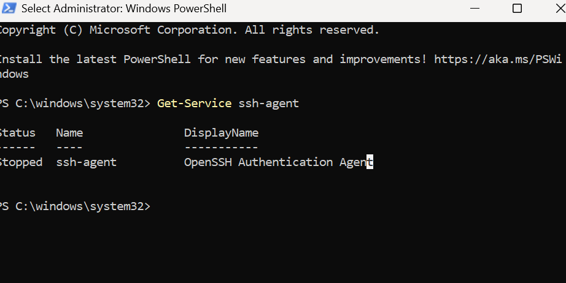
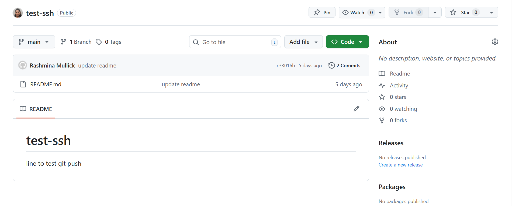

# Code-along – Use ssh authentication with a repo on GitHub
* Make section in documentation in regard to ssh
* Diagram:
Laptop = get the Git repo to be a GitHub repo (put git repo on GitHub pushing changes)
To have them synced together
When we do git push – there needs to be some authentication – it has been doing it with HTTPS
If we go over to GitHub, log in, and how do we know it uses HTTPS?
- When we do git remote origin – this it the endpoint of where we are pushing the remote
Instead of using HTTPS, we will use ssh à
Steps:
If we use ssh, what do we need available to set up the ssh authentication –
1. Create ssh key pair
Ssh key pair (we have been usings RSA – that is the algorithm to generate the keys) – 4096 bytes – would take thousands of years to hack – with a quantum computer would be possible, but until then this RSA key is pretty secure.
Ssh key pair – each key pair is made of
- private key –
- public key
We generated an SSH key pair using AWS console – we were given the private key as a .pem file – we cut and moved it in our .ssh folder and the public key was stored on AWS.
We also generated a key pair using a command on our local machine à we generated one manually on our machines to use with GCP.
We will need an ssh key pair
We will put the public key on what needs to be locked on GitHub à add padlock on there or register the padlock = means putting the public key on GitHub – we will be using this public key to any repo we want to log into
3. add the private key to ssh register on our machine.
4. We will go back to github to create a test repo
5. push changes to test repo to make sure we can use ssh to authenticate
1. Create RSA
– open Bash window
- Cd into ssh - Paste command in ssh-keygen -t rsa -b 4096 -C rashminamullick@gmail.com
- Name it rashmina-github-key
- 
- 
- Enter x 2
- ls to check ->
2. go over to GitHub and register the padlock –
3. click on the right picture – settings -
- fill in name
- in Bash – cat carla-github-key.pub to the Bash screen – make sure no extra characters are copied
- paste it in the github window and click add ssh key
gives read and write access to all repositories on GitHub.
4. Add private key to ssh register
Back on local machine
Run a process called ‘ssh agent’ (it will only exist in this terminal, if we open a new Bash it will not exist there, so carry on in same terminal)  
   * eval `ssh-agent -s` 
   * pid = process ID
  

* Showing an error no such file found as per the above picture:
  * Step I did go to the powershell and try to check if my SSH is running:
* 
  
* Now that we have the ssh agent process running, we add our key to it – we will use ssh add command and the private key after it 
   * ssh-add private-key-name
* Next, test the connection to GitHub – using an ssh command 
  * ssh -T git@github.com
1. Create a test repo
In Bash – cd
Then cd where we keep the github repos are:
Do a git clone - take the SSH endpoint for the Git repo Go over where we have all the git repos stored 
   * git clone git@github.com:rashminamullick/test-ssh.git
* cd into it
  * ls
  * Check the README.md is there
  * cat README.md
  * edit README.md either with nano Ctrl + S Ctrl + X
* OR with: echo "Write whatever you want and it'll go into the file" >> README.md - Alternative method to write into a file for testing
  * Git add .
  * Git commit -m “update readme”
  * Git push
* Check GitHub to see the line we added has populated.
* If we want to go back to using HTTPS, all we have to do is change the remote origin – and then go back to using HTTPS to authenticate.

# test-ssh
line to test git push

