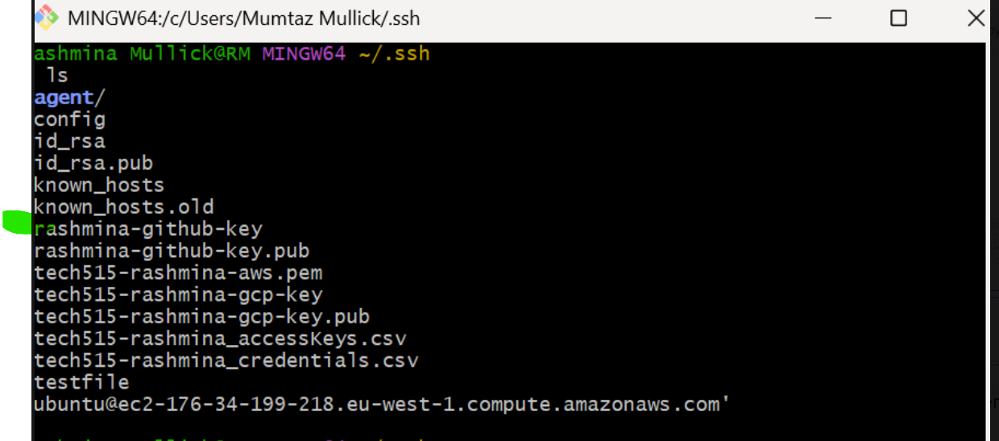

### SSH Authentication with GitHub (Code-Along Documentation)
#### Overview
This section documents how SSH authentication was set up between my local machine and GitHub.
SSH was chosen instead of HTTPS to support secure automation, password-free authentication, and real CI/CD usage.

#### This setup is essential for:
* Secure GitHub access
* Jenkins automation
* Industry-standard DevOps workflows

#### Why SSH Authentication Was Used
When pushing code to GitHub, authentication is required.

#### HTTPS (not ideal for CI/CD)
* Requires usernames/passwords or tokens
* Not suitable for automated systems like Jenkins
* Credentials can expire or be accidentally exposed
  
#### SSH (chosen approach)
* Uses cryptographic key pairs
* No passwords typed during git push
* Ideal for automation and CI/CD pipelines
* Keys can be revoked instantly if needed

#### How SSH Authentication Works:
SSH uses a key pair:
  * Private key → stays on the local machine (never shared)
  * Public key → uploaded to GitHub
When a git push happens:
 * GitHub checks the public key
 * The local machine proves it owns the matching private key
 * Access is granted securely

#### Step 1 — Create an SSH Key Pair (RSA 4096-bit)
An RSA key pair was generated locally using Git Bash.
  * Algorithm: RSA
  * Key size: 4096 bits
  * This provides strong encryption suitable for real-world use

After generation, the .ssh directory contained the new key files.

Image 1 – SSH keys created in .ssh folder
#### Use the screenshot showing the .ssh directory listing with:
* rashmina-github-key
* rashmina-github-key.pub

#### Step 2 — Register the Public Key with GitHub
To allow GitHub to trust my machine:
* I copied the contents of the public key file:
   cat rashmina-github-key.pub
* I navigated to GitHub → Settings → SSH and GPG keys
* The public key was pasted and saved
This registers the “padlock” on GitHub, allowing SSH access to repositories.

#### Step 3 — Start the SSH Agent 
#### The SSH agent is required to hold private keys in memory.
* Initially, when trying to add the key in Git Bash, I encountered an error:
   “Could not open a connection to the authentication agent”

* This happened because the SSH agent service was not running on Windows.

#### Step 4 — Fixing the SSH Agent Issue (PowerShell)
### To resolve the issue:
* I opened PowerShell as Administrator
* Checked the SSH agent service
* Set it to start automatically
* Started the service
#### Once running, the SSH agent became available to Git Bash.

* Get-Service ssh-agent
* Status: Running

* This fixed the authentication agent problem.

#### Step 5 — Add the Private Key to the SSH Agent
* With the agent running, the private key was added successfully:
   ssh-add rashmina-github-key
* The key is now securely stored in memory and available for Git operations.

#### Step 6 — Test SSH Connection to GitHub
* To confirm SSH authentication worked:
    ssh -T git@github.com

#### A successful response confirmed:
* GitHub recognised the key
* Authentication was working correctly

#### Step 7 — Test with a GitHub Repository
* To fully validate the setup, I created a test GitHub repository and performed the following:
  * Cloned the repo using the SSH URL.
  * Edited the README file
  * Committed the change
  * Successfully pushed using SSH
* This confirmed end-to-end SSH authentication.

* Image above – GitHub test repository showing pushed change
* Repository name test-ssh
* README updated
* Commit visible on GitHub

#### Outcome
### After completing these steps:
* SSH authentication worked without passwords.
* Git push and pull operations succeeded securely.
* The setup became suitable for Jenkins and CI/CD automation.

### Why This Matters for CI/CD
* This SSH setup enables:
    * Jenkins to access GitHub securely.
    * No credentials stored in pipeline scripts.
    * Easy revocation of access if needed.
    * A professional, industry-ready workflow

#### Key Takeaways
* SSH is the preferred authentication method.
* SSH agents must be running for keys to work.
* Windows requires extra care with SSH agent services.
* Once configured, SSH authentication is reliable and secure.

 
